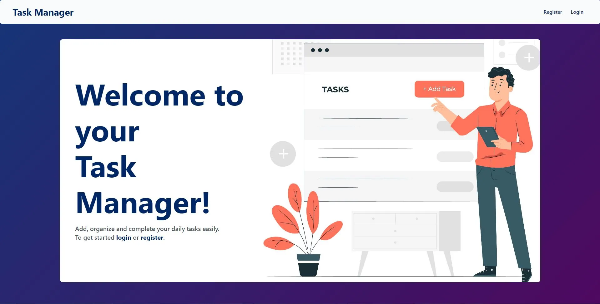

# 📌 Task Manager App

A **To-Do App** designed to help users keep track of their tasks. It allows users to add, edit, and delete tasks while ensuring secure authentication for personalized task management.

---

## 🚀 Features

✅ **Task Management**  
✔ Add, edit, and delete tasks.  
✔ Tasks are saved until completed.

✅ **User Authentication**  
✔ Secure login and registration system.  
✔ JWT-based authentication.

✅ **Personalized Task Lists**  
✔ Each user has a separate list of tasks.  
✔ Only accessible after logging in.

✅ **Responsive UI**  
✔ Clean and modern interface built with React & Tailwind CSS.

---

## 🛠 Tech Stack

| Technology    | Purpose                       |
|--------------|-----------------------------|
| **MongoDB**  | Database for storing tasks and user data |
| **Express.js** | Backend framework for API requests |
| **React.js**  | Frontend framework for the UI |
| **Node.js**  | JavaScript runtime for the server |
| **Tailwind CSS** | Styling framework for responsive design |
| **Vite**  | Development & build tool |

---

## ⚙ Requirements

Before running the project, make sure you have:

- **Node.js** (v14 or higher)
- **MongoDB** (local instance or MongoDB Atlas)

---

## 📥 Installation & Setup

### 1️⃣ Clone the Repository
```bash
   git clone https://github.com/CristianGonzalez24/todo-list-with-login.git
   cd todo-list-with-login
```

### 2️⃣ Install Dependencies
**Backend:**
```bash
   npm install
```

**Frontend:**
```bash
   cd client
   npm install
```

### 3️⃣ Configure Environment Variables
Create a `.env` file in the **root directory** and add:
```bash
   MONGO_URI=your_mongodb_uri
   JWT_SECRET=your_jwt_secret
```

### 4️⃣ Start the Backend Server
```bash
   npm run dev
```
🔹 Runs on **http://localhost:4000** (or the port specified in your config).

### 5️⃣ Start the Frontend
```bash
   cd client
   npm run dev
```
🔹 Runs on **http://localhost:5173**.

---

## 🎮 Usage

1. **Register**: Create a new account.
2. **Login**: Access your task manager.
3. **Manage Tasks**: Add, edit, and delete tasks.

---

## 🖼 Screenshots



---

## 🛠 Future Enhancements

🔹 **Unit Testing** with Jest.  
🔹 **Swagger API Documentation**.  
🔹 **Caching Mechanism** for improved performance.  
🔹 **Logging System** using Winston.  
🔹 **Advanced Error Handling** and security best practices.  

---

## 🤝 Contributing

Feedback and contributions are always welcome! To contribute:

1. **Fork** the repository.
2. Create a **feature branch** (`git checkout -b feature/your-feature-name`).
3. **Commit** your changes (`git commit -m 'Add new feature'`).
4. **Push** to your branch (`git push origin feature/your-feature-name`).
5. Open a **Pull Request**.

---

## 📜 License

This project is under the **MIT License** - see the [LICENSE](LICENSE) file for details.
